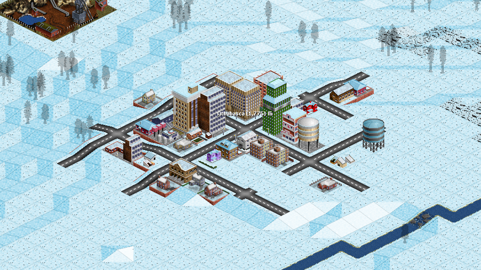
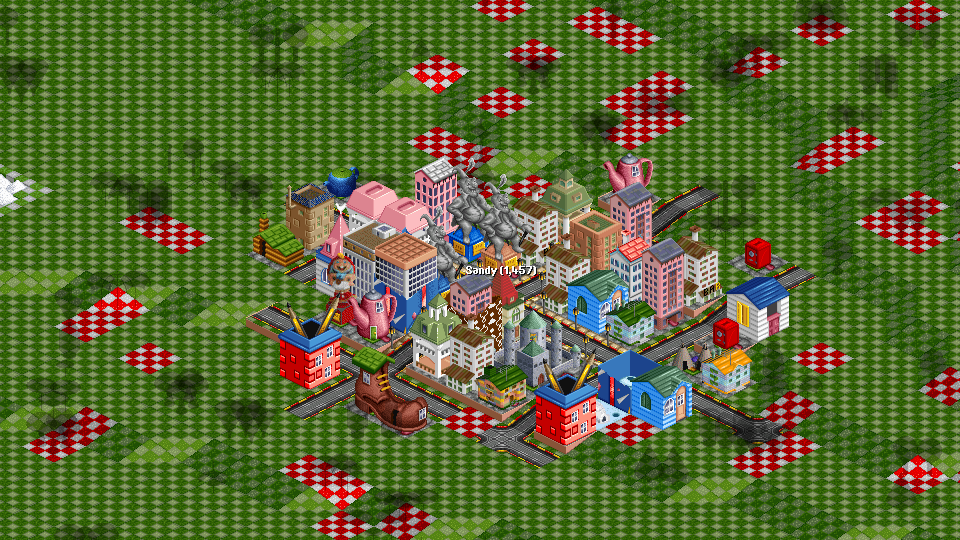

# OpenGFX+ Towns

A NewGRF which mixes OpenGFX houses with UK Town Set v2.2 to allow them being combined with other base sets and offer additional polish. Buildings shared between both sourced use UKTS statistics. Requires OpenTTD 15.0 or equvivalent.

## Previews

 

## Features

 - 16 cargo in/out support (flats accept both foods and goods, all Toyland shops and offices accept both fizzy drinks and candy). [^1] [^2] [^3]
 - Optionally allow using both vanilla and NewCC color gradients on both company and structure remap and bypass TTD 4-color-variations limit. [^1] [^2] [^3]
 - External parameter over stadium and church count. [^1] [^2] [^3]
 - Optionally protect multicell buildings inside inner town zones from town autoreplacement to prevent them being heavily underrepresented in an ongoing game. [^1] [^2] [^3]
 - Allow mixing various climates together. [^1] [^2]
 - Options to control how Hotels should handle Tourists (requires an external cargo NewGRF). [^1] [^2]
 - Rework ground sprites so that all ground sprites are composited from an overlay on top of a baseset sprite to prevent drawing artifacts appearing on the edges of cells against extra-zoom basesets. [^2] [^3]
 - Fix quantization errors and utilize struct remap on structures which could either use such in original TTD/OpenGFX2 or dominated by remapable colors. [^2] [^3]
 - Enable unused houses and frames scattered around the files. [^2]
 - Add new buildings derived from selected industry structures and similar objects to towns. (Note, some of these buildings require selected cargos to be available.) [^2]
 - Various additional snow, transparency or construction frames. [^2]
 - Split each building class into their individual buildings for a better integration with the place building tool. [^3]
 - Landscape selection to allow customizing the grass shade against OpenGFX2 or OpenGFX+ Landscape. [^3]

[^1]: This feature is shared with sister project [Universal Climate Houses](https://github.com/GraionDilach/universal-climate-houses).
[^2]: Change compared against OpenGFX houses.
[^3]: Change compared against UK Town Set.

## Changelog

### v1 changelog

 - Initial release.

## License

GPLv2, source available at https://github.com/GraionDilach/opengfx-towns

## Artwork/contributions

Zephyris: UK Town Set

OpenGFX contributors (see individual document for detailed list)

EmperorJake: NewCC gradients

PikkaBird: inspiration from Suburban Renewal Houses

## Author

Graion Dilach
